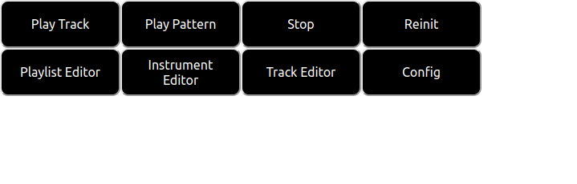

# A Brief User Interface Overview.
## How SeaSound Works.

SeaSound is an editor used to create and playback csound .csd files. The editor controls are used to describe csound code in a (hopefully) more user friendly manner than plain text editing a .csd file by hand. The controls can also be used to interact with csound's webaudio backend for playing back the audio described by the above mentioned .csd file.

## Getting Started.

On opening SeaSound you will be greeted with the following interface:

The top row contains buttons for basic control of the csound backend. The bottom row contains buttons for selecting editor tabs for the basic editing features of SeaSound.

These tabs are as follows:

1. The Playlist Editor: The playlist editor is where patterns created in the track editor can be arranged to create larger pieces of music.
2. The Instrument Editor: The instrument editor is where csound instruments can be created to generate audio.
3. The Track Editor: The track editor is where patterns/tracks can be created and played back. These tracks/patterns are made automatically available to the playlist editor for arrangement.
4. The Config Tab: The config tab is used to save/load projects, load in samples to the csound backend and to write headers/footers for the score/orchestra portions of the generated csound code.

The csound backend control buttons are as follows:

1. The Play Track Button: This generates and plays back the .csd file corresponding the project being worked on in the editor.
2. The Play Pattern Button: This does the same thing as the play track button but for the currently selected pattern in the track editor tab. Note that this generates the entire orchestra, not just the orchestra corresponding to the current pattern.
1. The Stop Button: This stops any playback.
1. The Reinit Button: This reinitializes the csound backend.

Note that by default the csound backend is not initialized until either the play track, play pattern or reinit buttons are selected.
