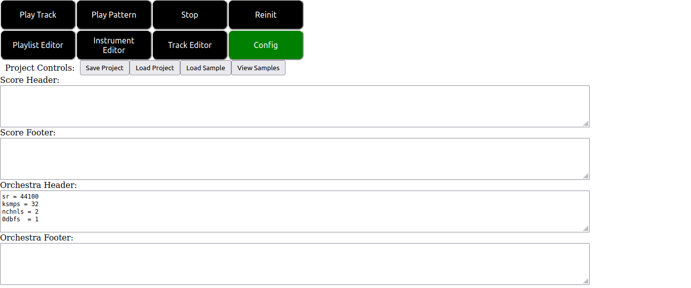

# The Config Editor.

## The Config Editor Overview.

The config tab of SeaSound has three purposes:

1. To enable the user to save and load SeaSound projects.
2. To enable the user to load/view samples loaded to the csound backend.
3. To allow the user to write header and footer code for the score and orchestra portions of their csound projects.

On clicking the config tab button at the top of the screen you are presented with the following user interface:



The controls shown in the above image are as follows:

1. The "Save Project" button downloads the project you are currently working on in a zip file to the downloads location specified by your browser.
2. The "Load Project" button can be used to select and load a zip file SeaSound project of the form specified above.
3. The "Load Sample" button allows you to load audio samples to the csound backend in the browser for use in your project.
4. The "View Samples" button displays a list of the audio samples you have loaded into your project currently.
5. The "Score Header" and "Score Footer" text sections allow you to write csound code that will be emitted at the start and end of the score section of the generated csd files for the project. This is a good place for things like f-statements, macros and other things you might want to apply for the whole projects score file.
6. The "Orchestra Header" and "Orchestra Footer" text sections allow you to write csound code that will be emitted at the start and end of the orchestra section of the generated csd files. As can be seen from the screentshot by default SeaSound places some basic info to do with the projects samplerate, number of channels and so on.


## The ZIP Project Format.

The zip project format used is relatively simple. Projects can be unzipped and picked apart by hand using your own software of choice. The directory structure of project zip files is as follows.

```
└── Project Name:
    ├── Project .wav files go here...
    ├── beats_per_block: For the beats per block value in the playlist editor.
    ├── beats_per_min: For the beats per min value in the playlist editor.
    ├── instruments: For storing the instruments of the project.
    │   └── Project .synth files go here...
    ├── orchestra_section.footer: Stores the orchestra footer of the project.
    ├── orchestra_section.header: Stores the orchestra header of the project.
    ├── score_section.footer: Stores the score footer of the project.
    ├── score_section.header: Stores the score header of the project.
    ├── tracklane.score: Stores the playlist editor canvas config of the project.
    └── tracks
        └── Project .track files go here...
```

In particular .track files, .synth files and samples can be accessed and loaded into projects individually after unzipping by using the "Load Instr", "Load Track" and "Load Sample" buttons explained in other tutorial modules.

## Some Warnings and Caveats.

- As of right now the saving and loading code is not designed for multiple loads within the same session. Rather than reloading multiple times in one session, you should refresh the page between subsequent loads to prevent errors.
- Before loading or saving a project the csound backend must be initialized. This can be done by pressing the "Reinit" button at the top right of the UI.
- The config editor is still relatively experimental. Future updates will include better UI and editors for this section.


[return](./tutorial-Tutorial Browser.html)
