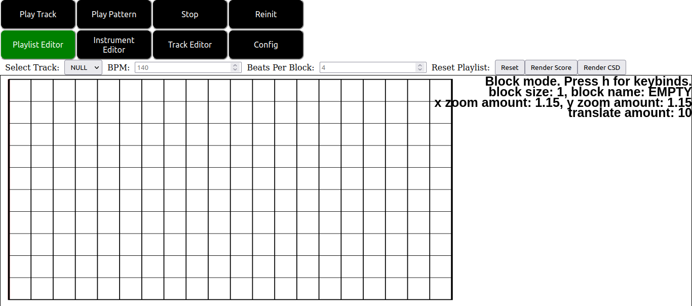
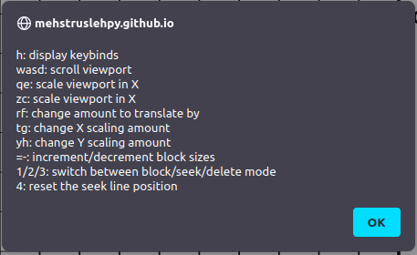
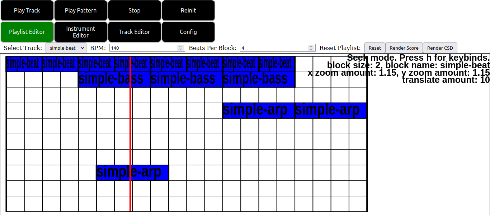

# The Playlist Editor.

## The Playlist Editor Overview.

The playlist editor is used for arranging tracks created in the track editor into a cohesive musical piece. The playlist editor is also used to control the play times and render your project to a full CSD file or to render the score of your project into a full score file.

On clicking the playlist editor tab button at the top of the screen you are presented with the following user interface:

The controls above the playlist canvas shown in this image are as follows:

1. Tracks made via the track editor may be selected via the "Select Track:" drop down. Initially, since no tracks are created this value is set to a default "NULL" value. Selecting tracks allows them to be input into the playlist canvas below.
2. The "BPM:" input field is where the beats per minute of your project is set.
3. The "Beats Per Block:" field determines the number of beats that each block in the playlist canvas consists of. This features is still experimental. For now it is best that you leave this field in its default state.
4. The "Reset" button pops up a dialog that allows you to reset the number of vertical/horizontal cells for the playlist canvas. Note that this will clear all the blocks from your current canvas. Ideally this should be selected at the start of your project.

## How The Playlist Canvas Works.

Below the buttons at the top of the screen is the playlist canvas. Note that the playlist canvas operates very similarly to the pianoroll canvas, but with some essential differences. Importantly, the playlist canvas is also a modal editor, though with different modes from the playlist canvas. Notice that in the top right of the display some basic status info is displayed in the canvas, including the current mode of the canvas as well as how to access a list of important keybinds via the h key. Pressing the h key yields the following menu.

These keybinds are as follows:

1. wasd keys are used to scroll the viewport.
2. qe keys and zc keys are used to scale in the X and Y directions respectively.
3. rf keys change the amount that translation occurs by with the wasd keys.
4. tg and yh keys change the X and Y scaling amouns respectively.
5. The - and = keys are deprecated and their usage is undefined.
6. The 1, 2 and 3 keys change the mode of the editor. They correspond to the block, seek and delete modes respectively, which we explain below.
7. The 4 key resets the seek bar position to its original position.

The basic modes of the editor are as follows.

1. In block mode right clicking the mouse is used to edit the blocks placed in the canvas. There are two cases:
    1.1. If you click on a space containing no existing blocks a new block is inserted at the location of the mouse cursor provided this block does not overlap any existing blocks. Note that this block is not placed until you release the mouse. Hence you may click and drag to place blocks in such a case.
    1.2. If you click on an existing block and hold, then you may drag the existing block to a new empty position on the canvas.
2. In seek mode right clicking changes the position in the playlist that playback via the "Play Track" button begins from. This is shown on the screen by the position of a red line.
3. In delete mode right clicking the mouse on a block in the editor deletes that block.

Note that placing blocks in the playlist editor is distinct from in the pianoroll editor in particular. Firstly, you cannot drag to change the lengths of tracks. Lengths of tracks are determined by the configuration values mentioned here and in the track editor as well as the length of the track you created. Thus these are determined by the length of track you select in the "Select Track:" dropdown rather than by any mouse movement. Secondly, blocks are not allowed to overlap. Trying to place one block on another such that the two blocks overlaps causes the new block to not be placed. Thirdly blocks can be moved after being placed as explained above.

Note also that blocks can be placed outside of the drawn boundaries of the canvas, though placing blocks to the left of the left boundary of the canvas will result in undefined behavior and possible crashing.

Below we show a sample playlist with sever patterns and modified seek position for playback part way into the song being worked on.

The resulting csd file of this score plays back the above patterns with appropriate offsets relative to their positions in the playlist canvas editor display. Additionally the resulting csound file has an offset setup to indicate that playback should occur at the time indicated by the red seek bar shown in the window.

Note that placing the seek bar to the left of the left boundary of the playlist editor will result in undefined behavior and possible crashing.

## An Exercise.

Try to recreate the sample project DrumBassArp.zip included with the csound source code by hand. Try to playback the audio from various positions by editing the seek position and pressing the "Play Track" button at the top of the display.

[return](./tutorial-Tutorial Browser.html)
